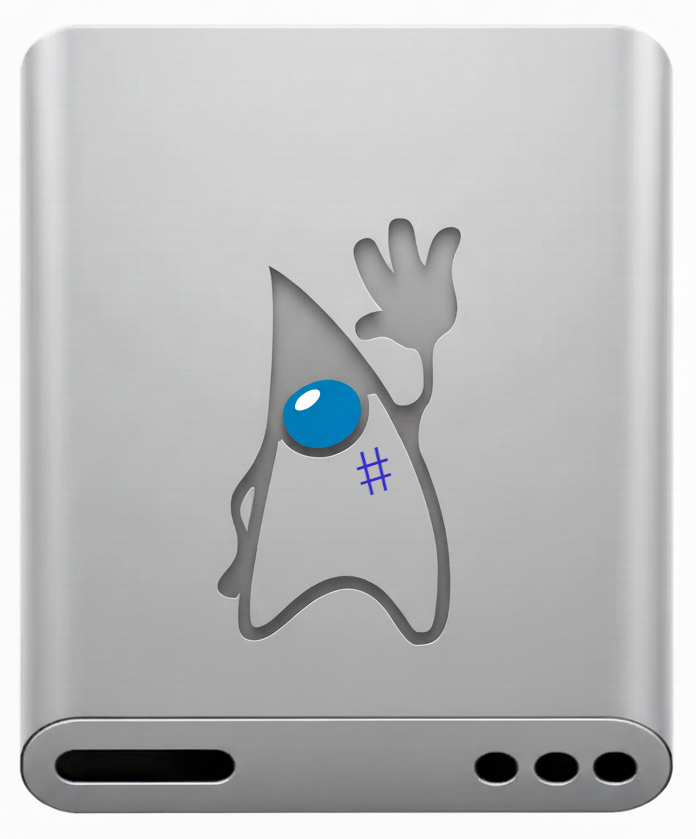

[](https://jitpack.io/#umjammer/vavi-nio-file-discutils)
[](https://github.com/umjammer/vavi-nio-file-discutils/actions/workflows/maven.yml)
[](https://github.com/umjammer/vavi-nio-file-discutils/actions/workflows/codeql-analysis.yml)

[](https://github.com/umjammer/vavi-apps-fuse)

# vavi-nio-file-discutils



A Java NIO FileSystem implementation over [DiscUtils](https://github.com/DiscUtils/DiscUtils)

you can also mount all formats using fuse.

### Status

| fs       | list           | upload | download       | copy | move | rm | mkdir | cache | watch | create | comment                                                                                                                               |
|----------|----------------|--------|----------------|------|------|----|-------|-------|-------|--------|---------------------------------------------------------------------------------------------------------------------------------------|
| UDF      |                |        |                |      |      |    |       | -     |       |        |                                                                                                                                       |
| FAT      | ✅ (RAW)        |        |                |      |      |    |       | -     |       |        |                                                                                                                                       |         |
| NTFS     | ✅ (VDI)        |        | ✅ (VDI)        |      |      |    |       | -     |       |        |                                                                                                                                       |
| HSF+     | ✅ (DMG)        |        |                |      |      |    |       | -     |       |        | 🚫 (ISO) same error on original                                                                                                       |
| EXT      | 🚧 (VDI)       |        |                |      |      |    |       | -     |       |        |                                                                                                                                       |
| XFS      |                |        |                |      |      |    |       | -     |       |        |                                                                                                                                       |
| ISO      | 🚧             |        |                |      |      |    |       | -     |       | ✅      |                                                                                                                                       |
| VHD      | ✅ (fat16)      |        | ✅ (fat16)      |      |      |    |       | -     |       |        | ~~🐛 subdir w/ fuse~~                                                                                                                 |
| VDI      | ✅ (ntfs,fat16) |        | ✅ (ntfs,fat16) |      |      |    |       | -     |       |        | ~~🐛 copy bytes slip out of place? w/ fuse~~                                                                                          |
| XVA      |                |        |                |      |      |    |       | -     |       |        |                                                                                                                                       |
| VMDK     |                |        |                |      |      |    |       | -     |       |        |                                                                                                                                       |
| DMG      | ✅              |        |                |      |      |    |       |       |       |        |                                                                                                                                       |
| Registry | ✅              |        |                |      |      |    |       | -     | -     | -      | Windows 10's registry                                                                                                                 |
| ├ BCD    | ✅              |        |                |      |      |    |       | -     | -     | -      | Windows XP's bcd                                                                                                                      |
| iSCSI    | 🚫             |        |                |      |      |    |       |       |       |        | server [jscsi](https://github.com/sebastiangraf/jSCSI)                                                                                |
| NFS      | 🚫             |        |                |      |      |    |       |       |       | -      | server [nfs4j](https://github.com/dcache/nfs4j)                                                                                       |
| ODS      | 🚫             |        |                |      |      |    |       |       |       | -      | server [vavi-net-ods](https://github.com/umjammer/vavi-net-ods)                                                                       |
| EMU      | ✅ (nhd:fat16)  |        |                |      |      |    |       | -     |       | -      | [vavi-nio-file-emu](https://github.com/umjammer/vavi-nio-file-emu) [vavi-nio-file-fat](https://github.com/umjammer/vavi-nio-file-Fat) |
| EMU      | ✅ (d88:fat12)  |        |                |      |      |    |       | -     |       | -      | [vavi-nio-file-emu](https://github.com/umjammer/vavi-nio-file-emu) [vavi-nio-file-fat](https://github.com/umjammer/vavi-nio-file-Fat) |
| EMU      | 🚧 (d88:n88)   |        |                |      |      |    |       | -     |       | -      | [vavi-nio-file-emu](https://github.com/umjammer/vavi-nio-file-emu) [vavi-nio-file-fat](https://github.com/umjammer/vavi-nio-file-Fat) |
| CHD      | ✅ (iso)        | -      | ✅ (iso)        | -    | -    | -  | -     | -     | -     | -      | [jpcsp(libchdr)](https://github.com/jpcsp/jpcsp)                                                                                      |
| QCOW2    | ✅ (gpt/ntfs)   | -      |  (gpt)         | -    | -    | -  | -     | -     | -     | -      | [vavi-nio-file-qcow2](https://github.com/umjammer/vavi-nio-file-qcow2)                                                                |

### Project Description

vavi-nio-file-discutils is a Java library to read and write ISO files and Virtual Machine disk files (VHD, VDI, XVA, VMDK, etc). DiscUtils is developed in Java with no native code.

Implementation of the ISO, UDF, FAT and NTFS file systems is now fairly stable. VHD, XVA, VMDK and VDI disk formats are implemented, as well as read/write Registry support. The library also includes a simple iSCSI initiator, for accessing disks via iSCSI and an NFS client implementation.

Note: this is a fork of https://github.com/DiscUtils/DiscUtils, which itself is a fork of https://github.com/quamotion/DiscUtils, which itself is a fork of https://discutils.codeplex.com/. 

#### Wiki (at original site)

See more up to date documentation at the [Wiki](https://github.com/DiscUtils/DiscUtils/wiki)

#### Implementation in this repository

This repository has performed a few changes to the core DiscUtils library. For starters, all projects have been converted to Java, and are targeting Java 8.

The vavi-nio-file-discutils library has been split into 25 independent projects, which can function without the others present. This reduces the "cost" of having vavi-nio-file-discutils immensely, as we're down from the 1 MB binary it used to be. 

To work with this, four Meta packages have been created:

* complete: Everything, like before
* containers: such as VMDK, VHD, VHDX
* fileSystems: such as NTFS, FAT, EXT
* transports: such as NFS
* partitions: such as apple, bios, pc98

#### Note on detections

vavi-nio-file-discutils has a number of detection helpers. These provide services like "which filesystem is this stream?".
For this to work, you must register your filesystem providers with the discUtils core. To do this, write:

    META-INF/services/`class name`

Where `class name` is the classes you wish to register.:

```properties
META-INF/services/discUtils.core.internal.LogicalVolumeFactory # From containers
META-INF/services/discUtils.core.vfs.VfsFileSystemFactory # From fileSystems
META-INF/services/discUtils.core.internal.VirtualDiskTransport # From transports
META-INF/services/discUtils.core.partitions.PartitionTableFactory # From partitions
```

## Install

* https://jitpack.io/#umjammer/vavi-nio-file-discutils

## Usage

as a java nio filesystem spi

```Java
 URI uri = URI.create("discutils:file:/Users/foo/bar.vdi");
 FileSystem fs = FileSystems.newFileSystem(uri, Collections.emptyMap());
 // use java nio file system
 Files.list(fs.getRootDirectories().iterator().next()).forEach(System.err::println);
 // mount as fuse
 Fuse.getFuse().mount(fs, "/your/mountPoint", Collections.emptyMap());
```

### system properties

<!-- * `discUtils.core.file.encoding` ... filename encoding for `Charset#forName(String)`, default is `MS932` -->
* `discUtils.core.pc98.validator.fat` ... , validator for finding fat literal default is `false`
* `discUtils.core.pc98.validator.ipl` ... , validator for finding ipl literal default is `true`
* `discUtils.core.pc98.validator.nec` ... , validator for finding nec literal, default is `true`
* `discUtils.core.pc98.Pc98FileSystemFactory.validation` ... `true`: do default validation, `false`: no validation, *else*: validation function name `class#method`, the method must return `boolean`

### How to use the Library

Here's a few really simple examples.

#### How to create a new ISO:

```Java
 CDBuilder builder = new CDBuilder();
 builder.useJoliet = true;
 builder.volumeIdentifier = "A_SAMPLE_DISK";
 builder.addFile("folder/Hello.txt", "Hello World!".getBytes(Charset.forName("ASCII")));
 builder.build("/tmp/sample.iso");
```

You can add files as byte arrays (shown above), as files from the Windows filesystem, or as a Stream. By using a different form of Build, you can get a Stream to the ISO file, rather than writing it to the Windows filesystem.


#### How to extract a file from an ISO:

```Java
 try (FileStream isoStream = File.open("/tmp/sample.iso")) {
   CDReader cd = new CDReader(isoStream, true);
   Stream fileStream = cd.openFile("folder/Hello.txt", FileMode.Open);
   // Use fileStream...
 }
```

You can also browse through the directory hierarchy, starting at cd.Root.

#### How to create a virtual hard disk:

```Java
 long diskSize = 30 * 1024 * 1024; // 30MB
 try (Stream vhdStream = File.create("/tmp/mydisk.vhd")) {
     Disk disk = Disk.initializeDynamic(vhdStream, diskSize);
     BiosPartitionTable.initialize(disk, WellKnownPartitionType.WindowsFat);
     try (FatFileSystem fs = FatFileSystem.formatPartition(disk, 0, null)) {
         fs.createDirectory("TestDir/CHILD");
         // do other things with the file system...
     }
 }
```

As with ISOs, you can browse the file system, starting at fs.Root.


#### How to create a virtual floppy disk:

```Java
 try (FileStream fs = File.create("myfloppy.vfd");
      FatFileSystem floppy = FatFileSystem.formatFloppy(fs, FloppyDiskType.HighDensity, "MY FLOPPY  ");
      Stream s = floppy.openFile("foo.txt", FileMode.Create)) {
     // Use stream...
 }
```

Again, start browsing the file system at floppy.Root.

## References

 * ~~https://github.com/twiglet/cs2j~~ → use ai
 * https://github.com/feyris-tan/dotnetIo4j [(vavi patched)](https://github.com/umjammer/dotnet4j)
 * bcd ... https://thestarman.pcministry.com/asm/mbr/BCD.htm
 * raw (dd) ... https://github.com/Zapotek/raw2vmdk
 * https://github.com/rasto/lcmc
 * chd
     * https://mamedev.emulab.it/haze/2012/02/16/chd-v5/
     * https://github.com/rtissera/libchdr
     * [jpcsc](https://github.com/jpcsp/jpcsp) has already java chd code! 🎯
 * qcow
     * [vavi-nio-file-qcow](https://github.com/umjammer/vavi-nio-file-qcow) ... libqcow via jna doesn't work well
     * [vavi-nio-file-qcow2](https://github.com/umjammer/vavi-nio-file-qcow2) 🎯 ... backing files are not supported
     * [vavi-nio-file-qcow2go](https://github.com/umjammer/vavi-nio-file-qcow2go) ... read api?

## TODO

 * ~~compile by jdk8~~
 * ~~https://github.com/AssafTzurEl/discUtils/commit/3853944811a16d6220dcb6e8d408561e05569e43~~
   * img ... https://github.com/hessu/bchunk
 * ~~file separator~~
   * test on windows 
 * ~~pc98 partition~~ (done)
 * ~~d88 floppy disk~~
 * ~~qcow2 (wip~~, ~~see [aaru](https://github.com/aaru-dps/Aaru)~~)
 * ~~chd (wip~~, ~~see aaru~~ libchdr in jpcsc)
   * qlgenerator (wip, see vavi.apps.qlgenerator package)
   * spi doesn't use discutil library. chd spi should be independent of this project
 * iso9660
   * `CommonVolumeDescriptor` as `user:attributes` 
   * https://github.com/Janix520/java-iso-tools
   * https://github.com/jpcsp/jpcsp/tree/master/src/jpcsp/filesystems/umdiso/iso9660
 * ~~registry~~
 * ~~🐛 vdi check sector length?~~ -> Util#SeekableByteChannel*
 * ~~git tree might be corrupted~~

---

<sub>disk image by Apple Inc. edited by Nano Banana</sub>
